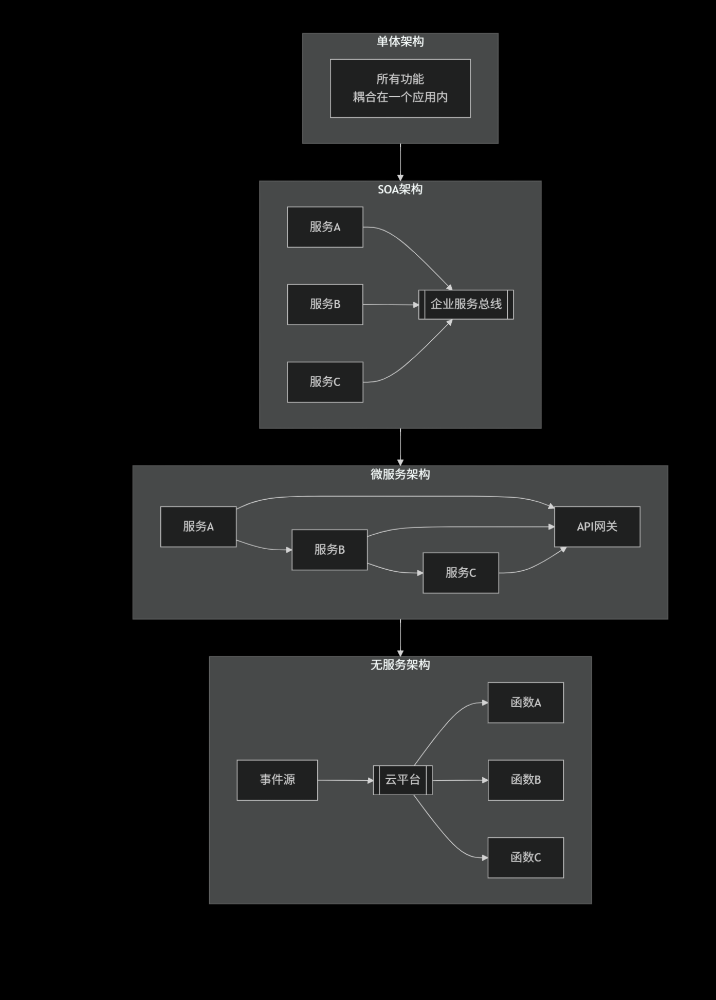

# 服务架构的进化之路
## 服务演进概览：从巨石到微粒
>**服务架构的演进，是一场围绕如何“分”与“合” 来应对系统复杂性的持续探索。**

### 一、单体架构：合一的起点
* 核心：所有功能打包成一个整体，统一开发、部署。

* 优点：简单高效，适合项目初期。

* 缺点：随着业务膨胀，会变得臃肿、难以维护和扩展。
### 二、SOA：中心化的“分”
* 核心：将应用拆分为粗粒度服务，通过企业服务总线（ESB） 连接。

* 优点：实现服务复用和系统集成。

* 缺点：ESB本身复杂，易成瓶颈，治理沉重。
### 三、微服务：去中心化的“分”
* 核心：将应用拆分为细粒度、松耦合的服务，服务间通过轻量API直接通信。

* 优点：服务独立，技术灵活，易于扩展和持续交付。

* 缺点：带来了分布式系统的复杂性（网络、事务、运维等）。
### 四、无服务：极致的“分”
* 核心：开发者只编写函数，由云平台负责所有运维，按事件触发运行。

* 优点：无需管理服务器，极致弹性，成本极低。

* 缺点：有冷启动问题，状态管理难，存在厂商锁定风险。
  
  

### 总结
架构演进的核心逻辑是：从单体“简单”的合，到SOA“中心化”的分，再到微服务“去中心化”的分，最终走向无服务“托管化”的极致细分。

>没有万能架构，只有适合场景的架构。理解每种架构的优缺点，才能做出最合适的选择。  
## 容器化与 Docker
### 一、核心概念
* 镜像：软件的安装包（比如 QQ 安装程序）

* 容器：安装包运行起来的程序（比如正在运行的 QQ）

### 二、为什么用 Docker？
* 解决“在我电脑能运行，到你那就报错”的问题。

### 三、最常用命令
```
- 构建镜像
docker build -t my-image .

- 运行容器
docker run -d -p 8080:80 my-image

- 查看运行中的容器
docker ps

- 查看容器日志
docker logs <容器名>

- 停止容器
docker stop <容器名>
```
### 四、Dockerfile 是什么？
告诉 Docker 如何构建镜像的说明书：
```
FROM nginx:alpine
COPY . /usr/share/nginx/html
EXPOSE 80
```
### 五、Docker Compose 是什么？
用一个文件同时启动多个容器（比如同时启动网站+数据库）：
```
services:
  web:
    build: .
    ports: 
      - "8080:80"
  db:
    image: mysql:8.0
```
* **总结：Docker 把软件和它的运行环境打包，保证在哪都能一样运行。**